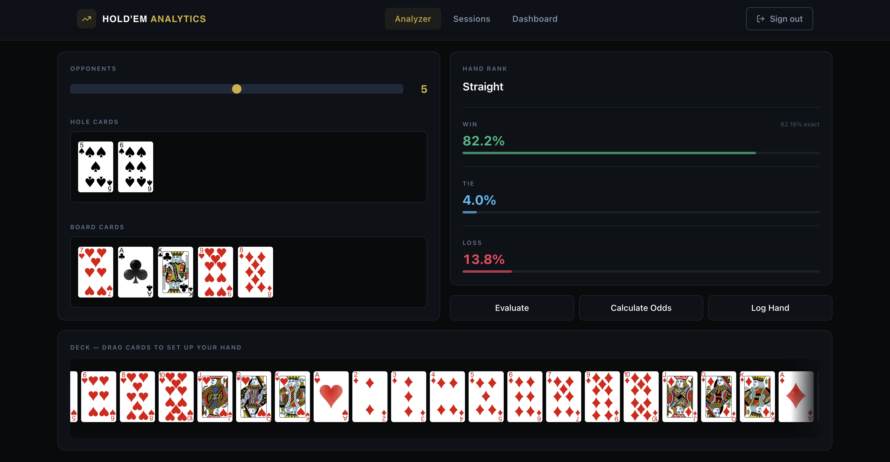
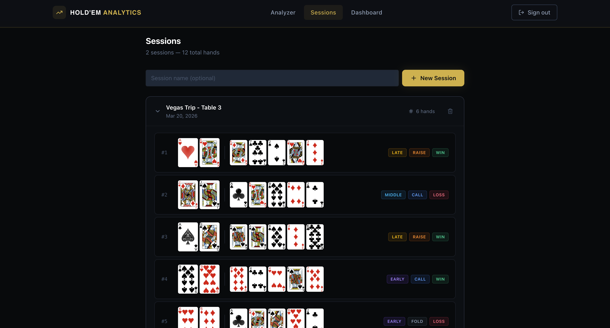
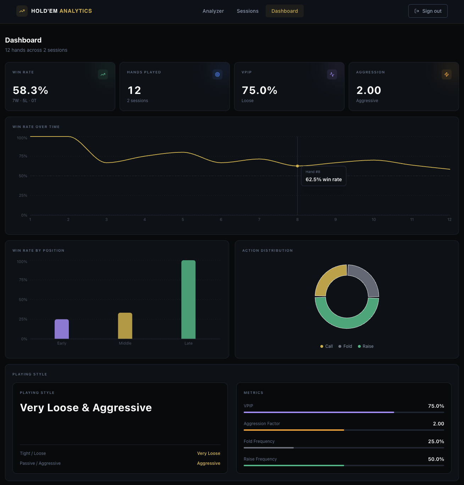

# Hold'Em Analytics

A full-stack poker analytics platform for hand evaluation, odds calculation, and session tracking. Built with Next.js, FastAPI, and a high-performance Go microservice for Monte Carlo simulations.

**[Live Application](https://holdem-analytics.com)** | **[API Documentation](http://98.93.1.240:8000/docs)** | **[Go Microservice Repository](https://github.com/KyleKDang/poker-odds-engine)**

---

## Overview

Hold'Em Analytics is a poker analysis platform for hand evaluation, odds calculation, and session tracking. The application uses a Next.js frontend, FastAPI backend, and a Go microservice for Monte Carlo simulations.

---

## Screenshots

### Hand Analyzer Interface


### Session Tracking


### Analytics Dashboard


---

## Features

### Hand Analysis Tools
- **Real-time Hand Evaluation**: Instant Texas Hold'em hand strength calculation with comprehensive hand ranking
- **Interactive Card Interface**: Drag-and-drop card selection system for simulating poker scenarios
- **Monte Carlo Odds Calculator**: Statistical win/tie/loss probability analysis against 1-9 opponents
- **Performance-Optimized**: Computational workload offloaded to [Go microservice](https://github.com/KyleKDang/poker-odds-engine) for 3-4x performance improvement over pure Python implementation

### User Management & Session Tracking
- **Secure Authentication**: JWT-based authentication system with bcrypt password hashing
- **Comprehensive Session Logging**: Record and track hands including hole cards, community cards, position, action taken, and session outcomes
- **Hand History Database**: Repository of historical hands organized by session

### Analytics & Reporting
- **Statistical Analysis Engine**: 10+ statistical methods providing deep insights into playing patterns
- **Key Performance Metrics**:
  - Win rate calculation and trend analysis
  - VPIP (Voluntarily Put In Pot) percentage
  - Aggression factor measurement
  - Position-based performance breakdown (early/middle/late position)
  - Action distribution analysis (fold/check/call/raise)
- **Data Visualizations**:
  - Line charts for win rate trends over time
  - Bar charts for positional performance analysis
  - Pie charts for action distribution
  - Playing style profile with derived metrics
  - Session performance summary tables

---

## Technical Architecture

### System Design

The application follows a microservices architecture with three primary components:

```
┌─────────────────────┐
│   Frontend Layer    │
│   (Next.js/React)   │
└──────────┬──────────┘
           │
           │ HTTPS
           ↓
┌──────────────────────┐         ┌────────────────────────┐
│  Application Server  │────────→│  Compute Microservice  │
│  (FastAPI/Python)    │  HTTP   │  (Go/Gin Framework)    │
│                      │         │                        │
│  • Authentication    │         │  • Hand Evaluation     │
│  • Business Logic    │         │  • Odds Calculation    │
│  • Session Management│         │  • Monte Carlo Sim     │
│  • Analytics Engine  │         │  (3-4x faster)         │
└──────────┬───────────┘         └────────────────────────┘
           │
           │ PostgreSQL
           ↓
┌──────────────────────┐
│   Database Layer     │
│   (AWS RDS)          │
│                      │
│  • User Data         │
│  • Session Records   │
│  • Hand History      │
└──────────────────────┘
```

### Technology Stack

#### Frontend
- **Framework**: Next.js with React and TypeScript
- **Styling**: Tailwind CSS for responsive design
- **Data Visualization**: Recharts for interactive charts and graphs
- **State Management**: React Hooks and Context API
- **HTTP Client**: Axios for API communication

#### Backend (Python)
- **Web Framework**: FastAPI with async/await support
- **ORM**: SQLModel for type-safe database operations
- **Authentication**: JWT tokens with bcrypt password hashing
- **Database**: PostgreSQL via asyncpg driver
- **Validation**: Pydantic models for request/response validation
- **Containerization**: Docker and Docker Compose

#### Compute Microservice (Go)
- **Repository**: [poker-odds-engine](https://github.com/KyleKDang/poker-odds-engine)
- **Framework**: Gin web framework
- **Concurrency**: Goroutines for parallel Monte Carlo simulations
- **Performance**: 3-4x faster than Python implementation for odds calculations
- **Deployment**: Containerized with Docker

#### Infrastructure
- **Frontend Hosting**: AWS Amplify with CI/CD pipeline
- **Backend Hosting**: AWS EC2 (t3.micro) running Docker containers
- **Database**: AWS RDS PostgreSQL (db.t3.micro) with automated backups
- **Domain & SSL**: Custom domain with SSL certificate management
- **Go Microservice**: Deployed on same EC2 instance

---

## Performance Characteristics

### Go Microservice Integration

The application leverages a specialized Go microservice for compute-intensive operations:

| Operation | Python Implementation | Go Microservice | Performance Gain |
|-----------|----------------------|-----------------|------------------|
| 1 opponent (10k simulations) | 764ms | 172ms | 4.4x faster |
| 3 opponents (10k simulations) | 1,206ms | 333ms | 3.6x faster |
| 9 opponents (10k simulations) | 2,700ms | 806ms | 3.3x faster |

**Key Benefits**:
- True parallelism via goroutines (no GIL limitations)
- Compiled native code execution
- Efficient memory management
- Linear scaling with number of opponents
- Sub-200ms response times for optimal user experience

For detailed performance benchmarks and technical implementation, see the [Go microservice repository](https://github.com/KyleKDang/poker-odds-engine).

---

## Deployment Architecture

### Production Environment

**Frontend (AWS Amplify)**:
- Automatic deployments triggered by GitHub commits
- Global CDN distribution
- SSL certificate management
- Environment variable configuration

**Backend (AWS EC2)**:
- Docker containerized deployment
- Nginx reverse proxy
- Systemd service management
- Automatic restart on failure

**Database (AWS RDS)**:
- PostgreSQL
- Automated daily backups
- Multi-AZ availability option
- Performance Insights enabled

**Go Microservice**:
- RESTful API communication
- Health check endpoints
- Independent update cycles

### Security Features

- JWT-based authentication with refresh tokens
- Bcrypt password hashing
- HTTPS/TLS encryption for all endpoints
- CORS configuration for frontend-backend communication
- SQL injection prevention via parameterized queries
- Environment variable management for sensitive credentials
- Database connection pooling with connection limits

---

## API Documentation

The FastAPI backend provides interactive API documentation:

- **Swagger UI**: [http://98.93.1.240:8000/docs](http://98.93.1.240:8000/docs)
- **ReDoc**: [http://98.93.1.240:8000/redoc](http://98.93.1.240:8000/redoc)

## Project Structure

```
holdem-analytics/
├── frontend/
│   ├── src/
│   │   ├── app/              # Next.js pages and routing
│   │   ├── components/       # React components
│   │   └── services/         # API client services
│   ├── Dockerfile
│   └── package.json
│
├── backend/
│   ├── app/
│   │   ├── api/
│   │   │   ├── routes/       # API endpoints
│   │   │   └── schemas/      # Request/response models
│   │   ├── core/
│   │   │   ├── evaluator/    # Hand evaluation logic
│   │   │   ├── odds/         # Odds calculation
│   │   │   └── models/       # Core data models
│   │   ├── db/               # Database connection
│   │   ├── models/           # Database models
│   │   ├── services/         # Business logic
│   │   └── main.py           # FastAPI application
│   ├── migrations/           # Database migrations
│   ├── Dockerfile
│   └── pyproject.toml
│
└── README.md
```

---

## License

MIT License - See LICENSE file for details

---

## Author

Kyle Dang - [GitHub](https://github.com/KyleKDang)
