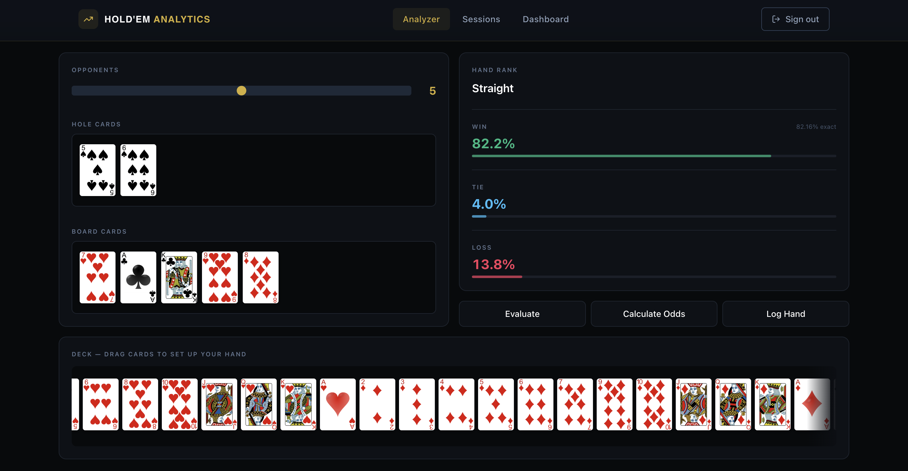
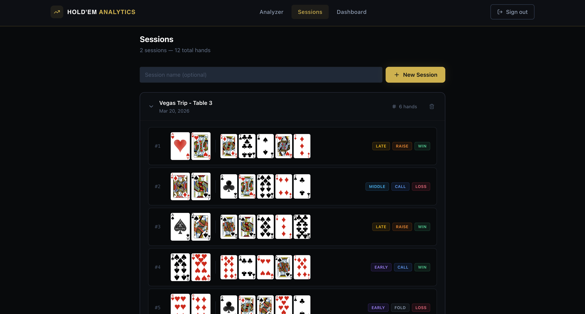
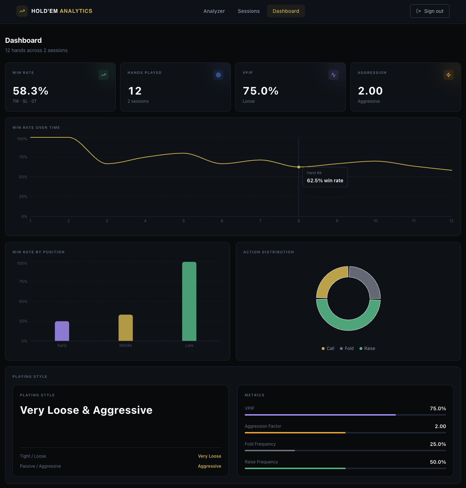

# Hold'Em Analytics

A full-stack Texas Hold'em analysis platform: evaluate hand strength, compute win probability by Monte Carlo simulation, log hands into sessions, and track playing-style statistics over time.

Compute-heavy odds simulation runs in a dedicated Go service so the Python API stays responsive under load.

[](https://holdem-analytics.com)
[](http://98.93.1.240:8000/docs)
[](https://github.com/KyleKDang/poker-odds-engine)
[](LICENSE)

**[Live Application](https://holdem-analytics.com)** · **[API Documentation](http://98.93.1.240:8000/docs)** · **[Go Odds Engine](https://github.com/KyleKDang/poker-odds-engine)**

---

## Contents

- [Overview](#overview)
- [Screenshots](#screenshots)
- [Features](#features)
- [Architecture](#architecture)
- [Tech Stack](#tech-stack)
- [Performance](#performance)
- [Getting Started](#getting-started)
- [API Reference](#api-reference)
- [Security](#security)
- [Testing](#testing)
- [Deployment](#deployment)
- [Project Structure](#project-structure)
- [Roadmap](#roadmap)
- [License](#license)

---

## Overview

Hold'Em Analytics answers two questions a poker player asks constantly: *how strong is this hand right now*, and *am I actually playing well over time*.

The first is a compute problem.
Estimating equity against up to nine opponents means dealing out the unknown cards thousands of times and ranking every resulting hand, which is tens of thousands of hand evaluations per request.

The second is a data problem.
It needs hands recorded with enough context (position, action, outcome) to derive meaningful statistics such as VPIP and aggression factor.

The system splits along that line.
A Next.js frontend handles the interaction, a FastAPI service owns authentication, persistence and analytics, and a separate Go service owns the simulation workload.

---

## Screenshots

### Hand Analyzer

Drag cards from the deck into the hole and board areas, then evaluate the hand or run an equity simulation.



### Session Tracking

Group logged hands into sessions and expand any session to review its hand history.



### Analytics Dashboard

Win rate trend, positional breakdown, action distribution and a derived playing-style profile.



---

## Features

### Hand Analysis

- **Hand evaluation** across all ten Texas Hold'em categories, from 1 to 7 cards, with kicker-aware tie-breaking (including the ace-low "wheel" straight).
- **Monte Carlo equity** against 1 to 9 opponents, returning win, tie and loss probability from 10,000 simulated runouts per request.
- **Drag-and-drop card interface** built on `@dnd-kit`, with a full 52-card deck, two hole slots and five board slots. Cards move freely in any direction between deck, hole and board, and work on touch as well as mouse.

### Session Tracking

- **JWT authentication** with bcrypt-hashed passwords.
- **Hand logging** capturing hole cards, board cards, table position, action taken and result, saved against a named session.
- **Session history** with per-session hand counts and a lazily loaded, expandable hand list.

### Analytics

Eleven derived metrics across eight endpoints, computed from logged hands:

- Win rate, overall and as a cumulative trend over time.
- **VPIP** (voluntarily put in pot) as the share of hands not folded.
- **Aggression factor**, raises divided by calls plus checks.
- Positional breakdown across early, middle and late position.
- Action distribution across fold, check, call and raise.
- A **playing-style profile** combining a tight-to-loose band with a passive-to-aggressive band.

Visualized with Recharts as a line chart for the win-rate trend, bar charts for positional and action breakdowns, and a summary table of recent sessions.

---

## Architecture

```
┌──────────────────────────┐
│      Frontend Layer      │
│   Next.js / React / TS   │
│      (AWS Amplify)       │
└────────────┬─────────────┘
             │  HTTPS, same-origin /api/*
             │  rewritten server-side by Next.js
             ↓
┌──────────────────────────┐        ┌──────────────────────────┐
│    Application Server    │───────→│    Compute Service       │
│     FastAPI / Python     │  HTTP  │      Go / Gin            │
│        (AWS EC2)         │  :8001 │   (same EC2 instance)    │
│                          │        │                          │
│  • JWT authentication    │        │  • Hand evaluation       │
│  • Sessions & hands CRUD │        │  • Monte Carlo odds      │
│  • Analytics engine      │        │  • Goroutine workers     │
└────────────┬─────────────┘        └──────────────────────────┘
             │  asyncpg
             ↓
┌──────────────────────────┐
│      Database Layer      │
│   PostgreSQL (AWS RDS)   │
│                          │
│  • user                  │
│  • session               │
│  • hand                  │
└──────────────────────────┘
```

### Request flow

The browser never addresses the API directly.
The Axios client is configured against the relative path `/api`, and Next.js rewrites `/api/:path*` to the FastAPI origin server-side.

This exists for a concrete reason.
The frontend is served over HTTPS behind a managed certificate, while the API origin serves plain HTTP, and a browser blocks an HTTPS page from issuing requests to an HTTP origin as mixed content.
Routing through a server-side rewrite moves that hop out of the browser, so every request the browser makes is same-origin HTTPS, and no certificate was needed on the API host to ship.

### Data model

Three tables: `user`, `session` (many per user) and `hand` (many per session).

Hole cards and board cards are stored in PostgreSQL array columns holding two-character codes such as `AS`, so a logged hand is a single row rather than a normalized set of card rows.

### Analytics derivation

No statistic is stored.
Every metric is derived per request from the raw `hand` rows, so correcting a logged hand immediately corrects every downstream statistic with no cache or aggregate to invalidate.
The `/analytics/dashboard` endpoint composes five of the analytics methods into one response so the dashboard loads in a single round trip.

---

## Tech Stack

### Frontend

| Technology | Version | Role |
| --- | --- | --- |
| Next.js | 15.5.3 | App Router, static route generation, server-side API rewrite |
| React | 19.1.0 | UI, client components throughout |
| TypeScript | 5.x | Type safety, `strict` mode |
| Tailwind CSS | 4.1.13 | Styling |
| @dnd-kit/core | 6.3.1 | Drag-and-drop card interface, pointer and touch sensors |
| Recharts | 3.4.1 | Dashboard charts |
| Axios | 1.12.1 | HTTP client with a JWT request interceptor |

### Backend

| Technology | Version | Role |
| --- | --- | --- |
| FastAPI | 0.116 | Async web framework |
| Uvicorn | 0.35 | ASGI server |
| SQLModel | 0.0.24 | ORM and table definitions |
| asyncpg | 0.30 | Async PostgreSQL driver |
| Alembic | 1.16 | Schema migrations |
| python-jose | 3.5 | JWT encode and decode (HS256) |
| passlib[bcrypt] | 1.7 | Password hashing |
| httpx | 0.28 | Client for the Go service |
| Pydantic | 2.x | Request and response validation |
| pytest | 8.4 | Test runner |

### Compute Service

Go with the Gin framework, using goroutines to parallelize simulation work across workers.
Maintained as a separate service in **[poker-odds-engine](https://github.com/KyleKDang/poker-odds-engine)** with its own deployment cycle.

### Infrastructure

PostgreSQL 16, Docker and Docker Compose, AWS Amplify, AWS EC2, AWS RDS.

---

## Performance

Odds calculation was originally implemented in Python, using a `ProcessPoolExecutor` to work around the GIL: the simulation loop is CPU-bound bytecode, so threads cannot parallelize it and separate processes were required, at the cost of fork and serialization overhead on every request.

Moving that workload to Go removed both costs.
Goroutines give true parallelism within one process, and the compiled evaluator is substantially faster per hand.

Both implementations, benchmarked on the same machine:

| Opponents | Python (FastAPI) | Go (Gin) | Speedup |
| --- | --- | --- | --- |
| 1 | 764 ms | 172 ms | **4.4x** |
| 3 | 1,206 ms | 333 ms | **3.6x** |
| 9 | 2,700 ms | 806 ms | **3.3x** |

**Benchmark conditions:** MacBook Air (M-series, 8 cores), 10,000 simulations, 4 workers, averaged over 5 trials, both implementations measured on the same hardware.
These figures compare the two implementations, not the deployed system: production runs on a `t3.micro`, which has two burstable vCPUs against the eight used for the benchmark, so absolute latency there is higher while the ratio holds.

Full benchmark breakdowns, including scaling by simulation count, worker count and board stage, are in the [odds engine repository](https://github.com/KyleKDang/poker-odds-engine#performance).

The Python implementation is retained in the codebase at `backend/app/core/` as a reference implementation and remains the code under test.

---

## Getting Started

### Prerequisites

- Docker and Docker Compose, or: Python 3.11+ with [Poetry](https://python-poetry.org/), Node.js 18+, and PostgreSQL 16
- The Go odds engine, cloned separately (see below)

### 1. Clone both repositories

The odds engine lives in its own repository and is expected at `./go-service` by Docker Compose:

```bash
git clone https://github.com/KyleKDang/holdem-analytics.git
cd holdem-analytics
git clone https://github.com/KyleKDang/poker-odds-engine.git go-service
```

### 2. Configure environment variables

Create `backend/.env`:

```bash
cp backend/env.example backend/.env
```

| Variable | Required | Default | Description |
| --- | --- | --- | --- |
| `DATABASE_URL` | yes | none | Async PostgreSQL DSN, e.g. `postgresql+asyncpg://postgres:postgres@db:5432/poker_analytics` |
| `SECRET_KEY` | yes | none | Signing key for JWTs. Generate with `openssl rand -hex 32` |
| `ALGORITHM` | no | `HS256` | JWT signing algorithm |
| `ACCESS_TOKEN_EXPIRE_MINUTES` | no | `30` | Access token lifetime |
| `GO_SERVICE_URL` | no | `http://localhost:8001` | Base URL of the odds engine |
| `FRONTEND_URL` | no | Amplify URL | Extra allowed CORS origin |
| `DEBUG` | no | `False` | Enables SQLAlchemy statement echo |

### 3. Run with Docker Compose

```bash
docker compose up --build
```

| Service | URL |
| --- | --- |
| Frontend | http://localhost:3000 |
| API | http://localhost:8000 |
| API docs | http://localhost:8000/docs |
| Odds engine | http://localhost:8001 |
| PostgreSQL | `localhost:5433` |

### 4. Or run each service directly

**Backend:**

```bash
cd backend
poetry install --with dev
poetry run alembic upgrade head
poetry run uvicorn app.main:app --reload --port 8000
```

**Frontend:**

```bash
cd frontend
npm install
npm run dev
```

**Odds engine:**

```bash
cd go-service
go mod tidy
go run cmd/server/main.go
```

### Database migrations

Alembic owns the schema.
Apply migrations with `poetry run alembic upgrade head`, and generate a new one after changing a model with `poetry run alembic revision --autogenerate -m "description"`.

---

## API Reference

Interactive documentation is generated by FastAPI: **[Swagger UI](http://98.93.1.240:8000/docs)** · **[ReDoc](http://98.93.1.240:8000/redoc)**

Twenty-five operations across six routers.

### Authentication

| Method | Endpoint | Description |
| --- | --- | --- |
| `POST` | `/auth/register` | Create an account |
| `POST` | `/auth/login` | Exchange credentials for a JWT access token |

### Analysis Tools

| Method | Endpoint | Description |
| --- | --- | --- |
| `POST` | `/tools/evaluate` | Evaluate the best hand from hole and board cards |
| `POST` | `/tools/odds` | Monte Carlo win, tie and loss probability |

### Sessions

| Method | Endpoint | Description |
| --- | --- | --- |
| `GET` | `/sessions` | List the caller's sessions with hand counts |
| `POST` | `/sessions` | Create a session |
| `GET` | `/sessions/{id}` | Retrieve one session |
| `DELETE` | `/sessions/{id}` | Delete a session and its hands |
| `GET` | `/sessions/{id}/hands` | List hands in a session |

### Hands

| Method | Endpoint | Description |
| --- | --- | --- |
| `POST` | `/hands` | Log a hand |
| `GET` | `/hands/{id}` | Retrieve a hand |
| `PUT` | `/hands/{id}` | Update a hand's action or result |
| `DELETE` | `/hands/{id}` | Delete a hand |

### Analytics

| Method | Endpoint | Description |
| --- | --- | --- |
| `GET` | `/analytics/dashboard` | All dashboard data in one response |
| `GET` | `/analytics/overview` | Totals, win rate, VPIP, aggression factor |
| `GET` | `/analytics/position` | Breakdown by table position |
| `GET` | `/analytics/action` | Breakdown by action taken |
| `GET` | `/analytics/timeline` | Cumulative win rate over time |
| `GET` | `/analytics/sessions` | Per-session performance |
| `GET` | `/analytics/heatmap` | Positional win-rate heat map data |
| `GET` | `/analytics/style` | Derived playing-style profile |

### System

| Method | Endpoint | Description |
| --- | --- | --- |
| `GET` | `/health` | Liveness check with a database connectivity probe |
| `GET` | `/users/`, `/users/{id}` | User lookup |

Analytics and session endpoints are scoped to the authenticated caller and require an `Authorization: Bearer <token>` header.

---

## Security

- Passwords hashed with bcrypt via `passlib`; plaintext is never stored.
- Stateless JWT bearer tokens, HS256, with a configurable expiry defaulting to 30 minutes.
- All request and response bodies validated by Pydantic models.
- Database access goes through SQLModel and SQLAlchemy exclusively, so every query is parameterized and there is no raw SQL.
- CORS restricted to an explicit origin allowlist rather than a wildcard.
- Credentials supplied as environment variables and excluded from version control; no secret appears anywhere in the git history.
- Browser traffic is served over HTTPS with a managed certificate and reaches the API same-origin through the Next.js rewrite.

---

## Testing

```bash
cd backend
poetry run pytest app/tests -v     # 24 tests
poetry run black --check app       # formatting
```

```bash
cd frontend
npx tsc --noEmit                   # type check
npm run lint                       # ESLint
npm run build                      # production build
```

The 24 backend tests cover the hand-evaluation core: every one of the ten hand categories at both five and seven cards, ace-low straight handling, and probabilistic sanity checks on the odds calculator.
They require no database or running service, since they exercise pure functions directly.

Extending coverage to the API and analytics layers is on the [roadmap](#roadmap).

---

## Deployment

| Component | Platform | Notes |
| --- | --- | --- |
| Frontend | AWS Amplify | Deploys automatically on push to `main`; CDN distribution and managed TLS certificate. The build runs ESLint and type checking, so a lint or type error fails the deploy. |
| API | AWS EC2 (`t3.micro`) | Dockerized FastAPI behind Uvicorn on port 8000 |
| Odds engine | AWS EC2 (`t3.micro`) | Dockerized Go service on the same instance, reached over loopback at port 8001 |
| Database | AWS RDS (`db.t3.micro`) | Managed PostgreSQL with automated backups |

Custom domain with a managed TLS certificate on the frontend.
The API and the odds engine communicate over loopback on the shared instance, so that hop does not cross the network.

`/health` returns application status alongside a live database connectivity check, and is the endpoint to poll when verifying a deploy.

---

## Project Structure

```
holdem-analytics/
├── frontend/
│   ├── src/
│   │   ├── app/                  # App Router pages
│   │   │   ├── page.tsx          #   analyzer (drag-and-drop, evaluate, odds)
│   │   │   ├── sessions/         #   session list and hand history
│   │   │   ├── analytics/        #   dashboard
│   │   │   ├── login/
│   │   │   └── register/
│   │   ├── components/
│   │   │   ├── Card.tsx          #   draggable card
│   │   │   ├── Deck.tsx          #   scrollable 52-card deck
│   │   │   ├── DroppableArea.tsx #   fixed-slot hole and board areas
│   │   │   ├── HandLoggerModal.tsx
│   │   │   └── analytics/        #   Recharts chart components
│   │   └── services/api.ts       # Axios instance with JWT interceptor
│   ├── next.config.ts            # server-side /api rewrite
│   └── Dockerfile
│
├── backend/
│   ├── app/
│   │   ├── api/
│   │   │   ├── routes/           # auth, tools, sessions, hands, users, analytics
│   │   │   └── schemas/          # Pydantic request/response models
│   │   ├── core/
│   │   │   ├── evaluator/        #   reference hand evaluator (Python)
│   │   │   ├── odds/             #   reference Monte Carlo simulation (Python)
│   │   │   ├── models/card.py
│   │   │   ├── security.py       #   hashing and JWT creation
│   │   │   ├── deps.py           #   get_current_user dependency
│   │   │   └── config.py
│   │   ├── models/               # SQLModel tables: user, session, hand
│   │   ├── services/             # analytics_service.py
│   │   ├── db/session.py         # async engine and session factory
│   │   ├── tests/                # pytest suite
│   │   └── main.py               # FastAPI app and router registration
│   ├── migrations/               # Alembic revisions
│   ├── pyproject.toml
│   └── Dockerfile
│
├── go-service/                   # cloned from poker-odds-engine (not vendored)
├── docker-compose.yml
└── README.md
```

---

## Roadmap

- **CI pipeline.** Run the backend test suite, formatter, type check and linter on every push. The frontend build is currently gated by Amplify; the backend has no automated gate.
- **Broaden test coverage** from the hand-evaluation core to the route layer, the analytics service and the Go integration.
- **TLS on the API origin** so the backend can be addressed directly rather than only through the frontend rewrite, and so the docs link is served over HTTPS.
- **SQL-side analytics aggregation.** Metrics are currently derived in Python per request, which re-reads a user's hands once per metric. Pushing the aggregation into SQL, and paginating the timeline series, is the change that matters as hand volume grows.
- **Session lifecycle.** `session.end_time` exists in the schema but is never written; closing sessions would enable duration-aware statistics and date-range filtering on the dashboard.
- **Structured logging and error tracking**, currently absent.

---

## License

Released under the [MIT License](LICENSE).

## Author

**Kyle Dang** - [GitHub](https://github.com/KyleKDang)
